---
## Front matter
lang: ru-RU
title: Лабораторная работа №4
author: |
	Сидоракин
institute: |
	 RUDN University, Moscow, Russian Federation
date: Сентябрь, 2021 Москва

## Formatting
toc: false
slide_level: 2
theme: metropolis
sansfont: NotoMono-Regular
header-includes: 
 - \metroset{progressbar=frametitle,sectionpage=progressbar,numbering=fraction}
 - '\makeatletter'
 - '\beamer@ignorenonframefalse'
 - '\makeatother'
aspectratio: 43
section-titles: true
---
## Цель лабораторной работы

Получение практических навыков работы в консоли с расширенными атрибутами файлов

## Процесс выполнения лабораторной работы

## Определяем расширенные атрибуты файла

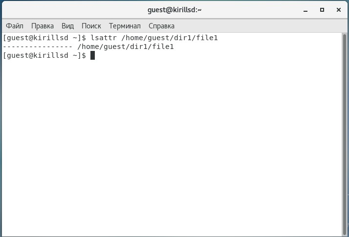{ #fig:001 width=50% }

## Устанавливаем на файл права, разрешающие чтение и запись

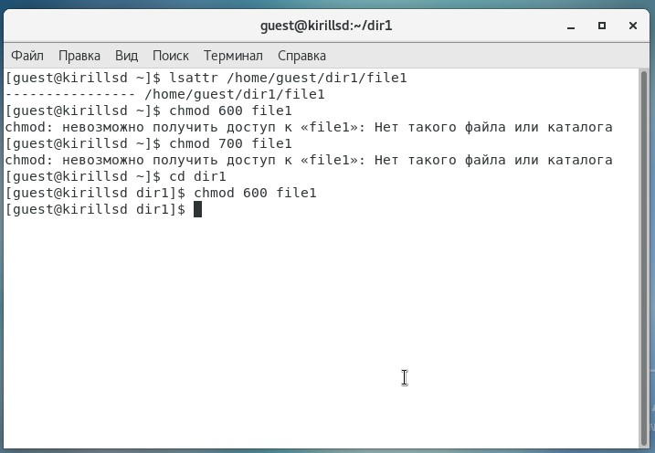{ #fig:002 width=50% }

## Попробуем установить на файл расширенный атрибут "a"
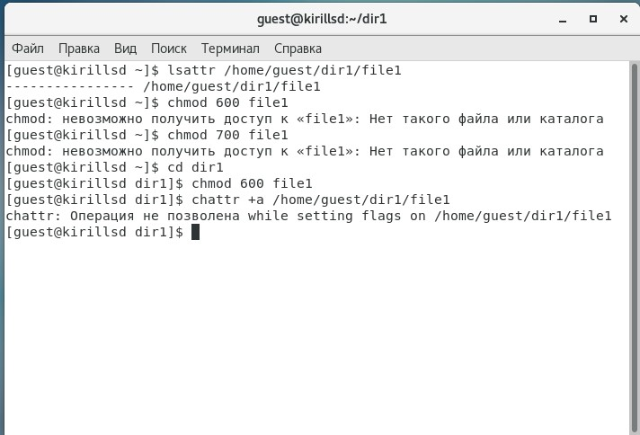{ #fig:003 width=50% }

## От имени суперпользователя
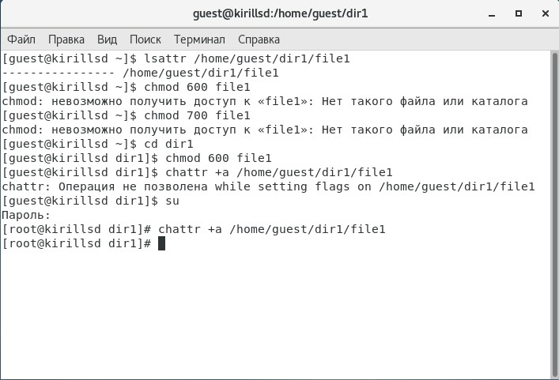{ #fig:004 width=50% }

## Проверяем правильность установления атрибута
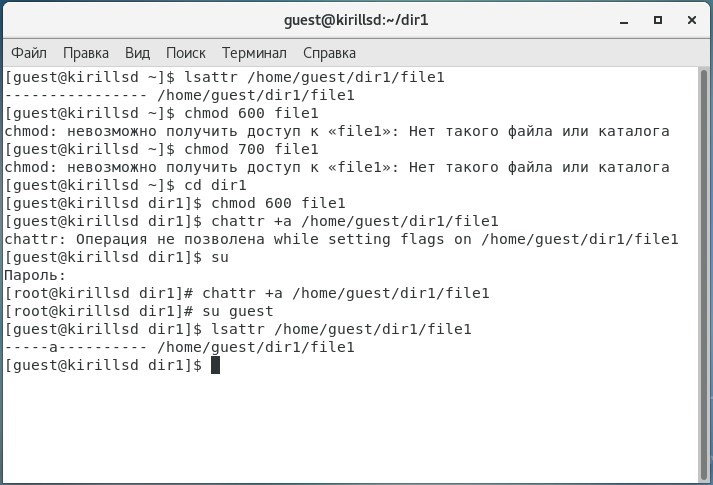{ #fig:005 width=50% }

## Выполняем дозапись в файл file1 слова «test» 
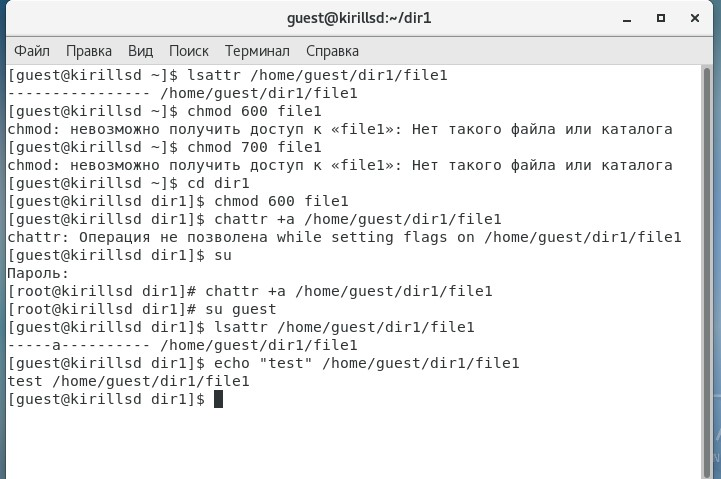{ #fig:007 width=50% }

## Считываем файл file1 командой cat  
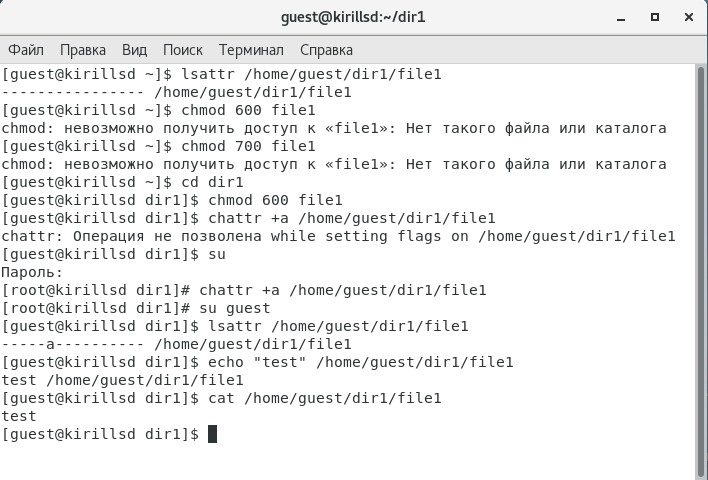{ #fig:008 width=50% }

## Попробуем удалить файл file1 либо стереть информацию 
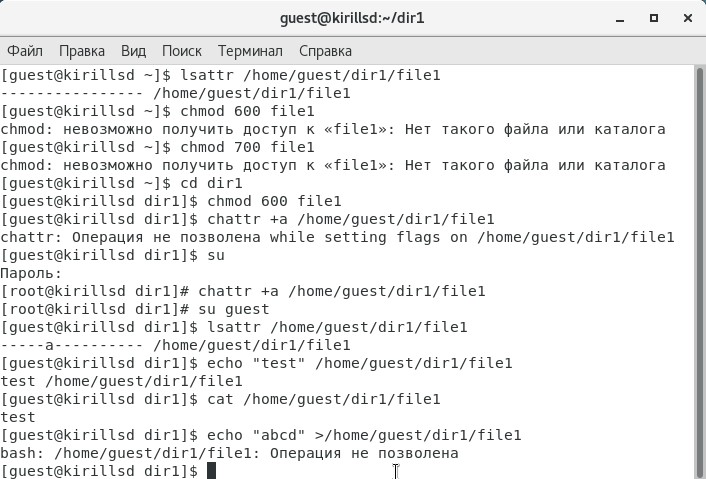{ #fig:009 width=50% }

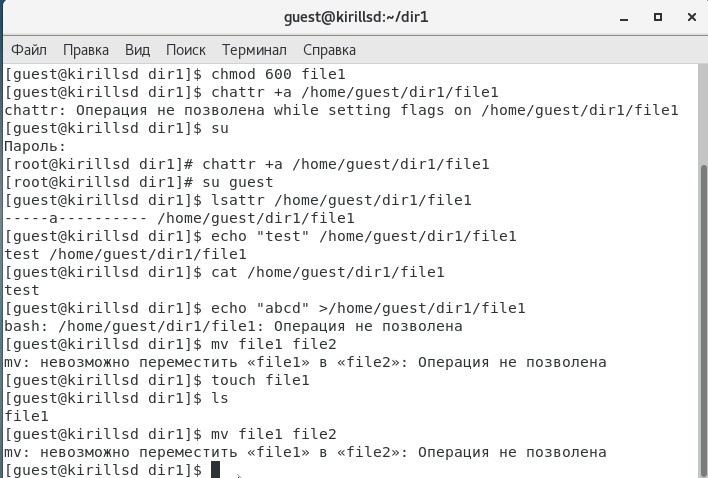{ #fig:010 width=50% }

## Попробуем установить запрет на чтение и запись 

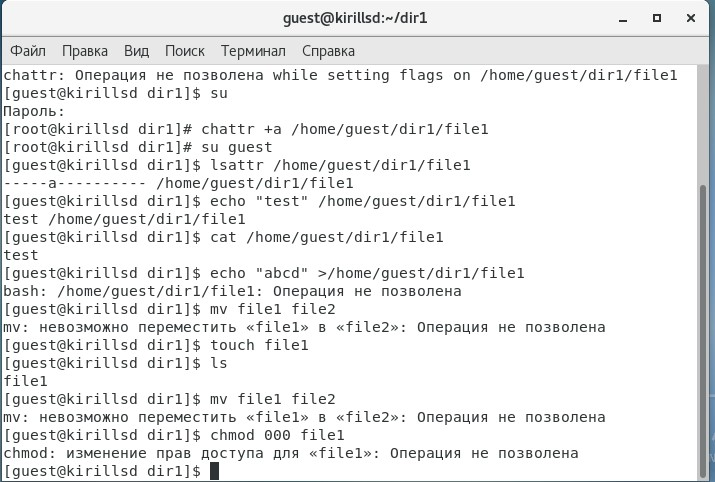{ #fig:001 width=50% }

## Снимаем расширенный атрибут "a" от имени суперпользователя 
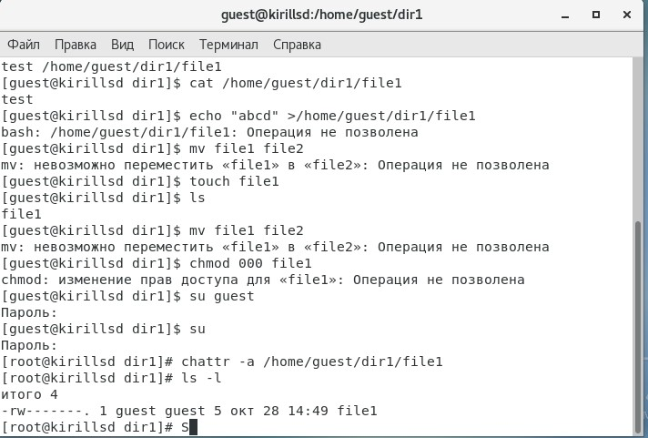{ #fig:013 width=50% }

## Повторяем операции, которые нам ранее не удавались
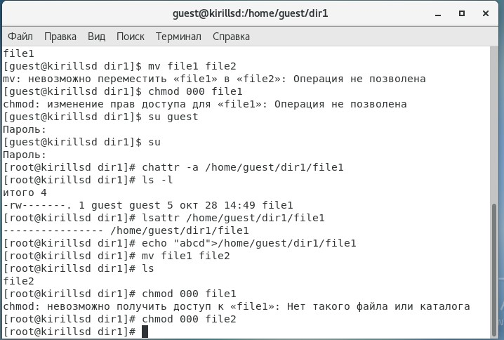{ #fig:014 width=50% }

## Повторяем действия по шагам, заменив атрибут «a» на «i»
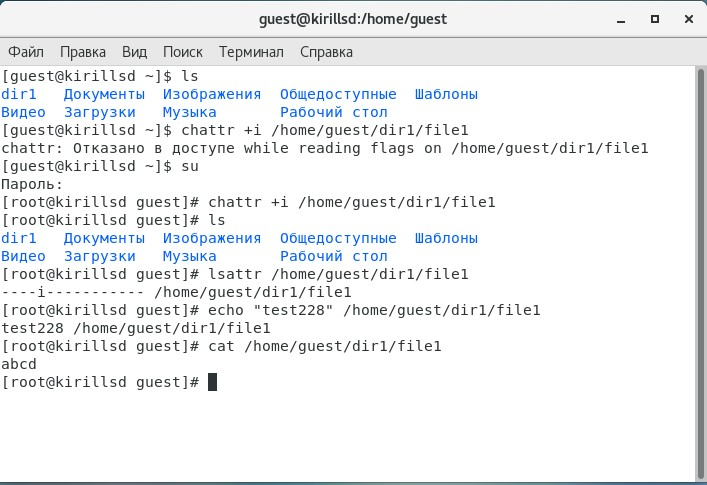{ #fig:016 width=50% }

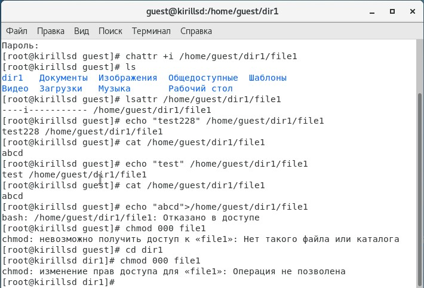{ #fig:016 width=50% }

## Вывод
В результате выполнения работы вы повысили свои навыки использования интерфейса командой строки (CLI), познакомились на примерах с тем, как используются основные и расширенные атрибуты при разграничении доступа.